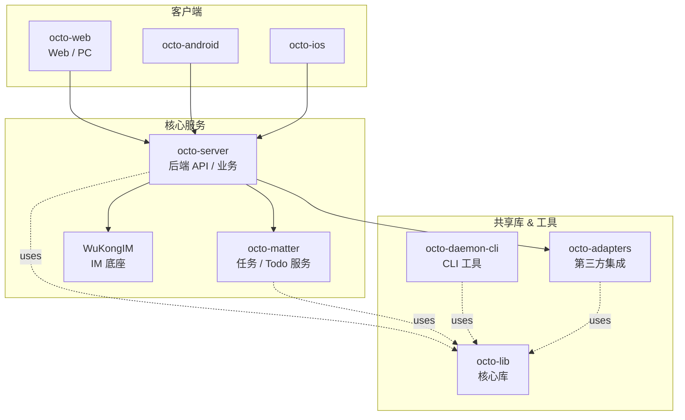

<p align="center">
  
</p>

<p align="center">
  <b>OCTO — 为人和 AI Agent 协作而生的开源工作平台</b><br/>
  <sub>让 <b>龙虾（Lobster / OpenClaw-powered digital double agents）</b> 去「思」和「行」，让人聚焦在「品」</sub>
</p>

<p align="center">
  <a href="https://github.com/Mininglamp-AI/octo-server#-what-is-octo"><b>📖 产品 Overview · What is OCTO</b></a> ·
  <a href="#-quickstart"><b>🚀 Quickstart</b></a> ·
  <a href="#-octo-ecosystem"><b>📦 Ecosystem</b></a> ·
  <a href="./CONTRIBUTING.md"><b>🤝 Contributing</b></a>
</p>

---

> 🌐 **Read in**: **English** · [简体中文](README.zh.md)

# OCTO Matter

> **Lightweight task / todo / "matter" service** for the OCTO platform.

`octo-matter` is a Go service that manages **matters** — a generalised
task / todo / action-item primitive used by the OCTO clients and by
Lobster agents. It exposes a REST API for create / update / assign /
close, plus a timeline sub-service that records activity against each
matter (comments, status changes, LLM-extracted follow-ups).

## ✨ Features

- CRUD + assignment + visibility controls for matters
- Per-matter **timeline** with append-only activity records
- Pluggable **LLM extractor** that turns free-form text (chat snippets,
  meeting notes) into structured matter drafts
- **Notifier** abstraction for integrating with the OCTO IM backend
  (default) or any HTTP webhook sink
- Minimal external dependencies — MySQL + Redis + an LLM endpoint

## 🚀 Quickstart

```bash
git clone https://github.com/Mininglamp-AI/octo-matter.git
cd octo-matter
go build ./cmd

# configure via env vars (see internal/config/config.go for the full list)
export LLM_API_URL=https://api.example.com/v1
export DB_DSN='user:pass@tcp(127.0.0.1:3306)/matter?parseTime=true'

./cmd serve
```

## 🧱 Modules

Top-level packages under this module:

| Path | Purpose |
|---|---|
| `cmd/` | Service entrypoint + timeline transaction helper |
| `internal/config/` | Env-driven config loader |
| `internal/handler/` | HTTP handlers (matter, timeline, activity, extract) |
| `internal/service/` | Business logic (access control, LLM extraction, timeline) |
| `internal/repository/` | MySQL repositories for matters, assignees, channels, timelines |
| `internal/llm/` | LLM client — OpenAI-compatible `/v1/chat/completions` |
| `internal/notification/` | Notifier interface + OCTO-IM implementation |
| `internal/apperr/` | Typed application errors |
| `internal/model/` | Shared data models |
| `internal/middleware/` | Auth / logging / recovery middleware |
| `migrations/` | SQL schema migrations |

## 🛠️ Ecosystem

Part of the [OCTO](https://github.com/Mininglamp-AI) open-source platform.

## 🤝 Contributing

See [CONTRIBUTING.md](CONTRIBUTING.md). Please also read our [Code of Conduct](CODE_OF_CONDUCT.md).

## 📄 License

Apache License 2.0 — see [LICENSE](LICENSE).

---

Made with 🐙 by the OCTO community.

---
<!-- Shared snippet: OCTO repo matrix. Keep identical across all 8 repos. -->

## 📦 OCTO Ecosystem（仓库矩阵）



| 仓库 | 语言 | 职责 | 状态 |
|------|------|------|------|
| [`octo-server`](https://github.com/Mininglamp-AI/octo-server) | Go | 后端 API、业务编排、龙虾调度 | Public |
| [`octo-matter`](https://github.com/Mininglamp-AI/octo-matter) | Go | 任务 / Todo / Matter 服务 | Public |
| [`octo-web`](https://github.com/Mininglamp-AI/octo-web) | TypeScript / React | Web & PC 客户端 | Public |
| [`octo-android`](https://github.com/Mininglamp-AI/octo-android) | Kotlin / Java | Android 客户端 | Public |
| [`octo-ios`](https://github.com/Mininglamp-AI/octo-ios) | Swift / Objective-C | iOS 客户端 | Public |
| [`octo-lib`](https://github.com/Mininglamp-AI/octo-lib) | Go | 核心领域模型 / 协议 / 工具库 | Public |
| [`octo-daemon-cli`](https://github.com/Mininglamp-AI/octo-daemon-cli) | Go | 运维/接入 CLI、本地守护进程 | Public |
| [`octo-adapters`](https://github.com/Mininglamp-AI/octo-adapters) | TypeScript / Python | 第三方系统集成（IM / SSO / 存储等） | Public |
| [`WuKongIM`](https://github.com/Mininglamp-AI/WuKongIM) | Go | IM 底座（fork，针对 OCTO 增强） | Public |
